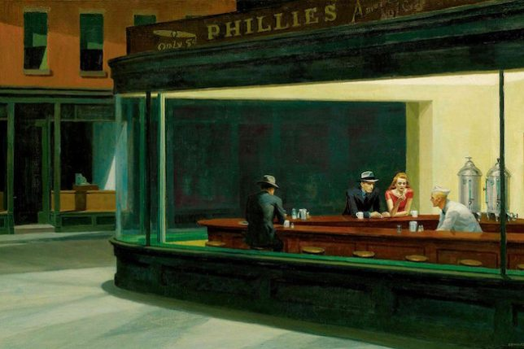
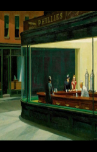
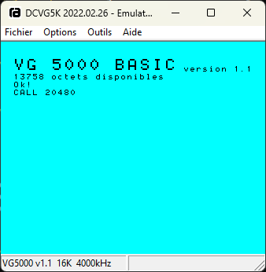
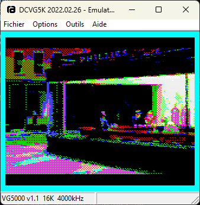

# Vg5kGraphics
**_An [EF9345](https://en.wikipedia.org/wiki/Thomson_EF9345) Quest !_**

_(Or how to display full screen image on a [VG5000](https://en.wikipedia.org/wiki/Philips_VG5000))._


You like programming with constraints? You will love the following. 

The best you can do to display an image on this machine is to use the semi graphic quadrichromic mode which allows you to:
- redefine a maximum of 500 quadrichomic characters.
- a quadrichromic character can have 4 colors on a palette of 8 colors (white, cyan, magenta, blue, yellow, green, red, black).
- a quadrichromic character is defined by 10 slices of 4 px width (ie 4*10 px).
- each row contains 40 characters,
- for 25 rows,
- which allows a resolution of 160*250 px.

To create an image, you need to :
- crop the original image into rectangles of 4*10 px.
- create a quadrichromic character from them.
- tell the ef9345 to display each created character at the right place.

What's problematic is that 500 characters is not enough to cover the entire screen. Two cases: 
- your image have a lot of characters in common, you need 500 or less characters -> OK, go for display
- your image have few characters in common, you need more than 500 characters -> you will have to pair look alike characters to lower characters count under 500. 
A kind of lossy compression.

# Guideline
## 1. Image reshaping
With a ratio of 0.64, the pixels in 160*250 are not square. It is necessary to transform the original image into something which is squeezed in width:
```code
python resizeToVg5k.py .\Nighthawkss-644x429.jpeg
```
It will produce a well dimensioned image called "im_reframed.png". Original script is available [here](https://gist.github.com/mieki256/de2e21417528f724da4853cc30d9ef95).

<table>
<tr>
    <td></td>
    <td></td>
</tr>
</table>

## 2. Image dithering
### Standard ordered dithering
The ditherTo8Colors.py script will produce a 8 colors paletted image from previous framed one.
It uses standard ordered dithering method with a 2*4 bayer rectangular matrix adapted to the VG5000 resolution.
```code
python .\ditherTo8Colors.py .\im_reframed.png .6
```
Arguments are image name and gamma correction.


### Yliluoma's ordered dithering
A far best method to dither image took from https://bisqwit.iki.fi/story/howto/dither/jy/. Original script is available [here](https://gist.github.com/mieki256/de2e21417528f724da4853cc30d9ef95).
It uses the same matrix as previous script.
```code
python .\ditherTo8ColorsY.py .\im_reframed.png .9
```
Arguments are image name and gamma correction.


### Other methods ?
Use an [Image magick](https://legacy.imagemagick.org/Usage/quantize/) dithering method.

For example:
```code
magick.exe im_reframed.png -posterize 8 -ordered-dither o2x2 -remap palette.png -scale 100% im_ordered.png
```


Problem is that Image Magick is using a square matrix and even if dithering is good, it is not as good as previous method for the uncommon VG5000 resolution.

## 3. Transform image to Z80 assembly code
```code
python .\convertToZ8.py .\im_ordered.png > hopper.asm
```
A new file named hopper.asm will be created.

## 4. Compile assembly code to binary code
A z80 compiler is mandatory. [Z88dk](https://z88dk.org/site/download) is a good one.
Launch:
- ```z88dk_prompt.bat``` to set the environment.
- ```z80asm.exe -b hopper.asm``` to transform assembly code into binary code.

A binary file ```hopper.bin``` is then created.

## 5. Launch binary code
To launch code, you need either:
- a real VG5000,
- or a [VG5000 emulator](http://dcvg5k.free.fr/download/emu/dcvg5k_20220226.zip).

The binary code is relocated at adress $5000 in hexadecimal (20480 in decimal). In the emulator, type F9 to access to the "Mise au point" panel. Then set "Adresse" to 5000 in the right field. Then load "hopper.bin" file by clicking on the right sided button.


To launch binary code : ```CALL 20480``` in the basic editor.

<table>
<tr>
    <td></td>
    <td></td>
</tr>
</table>

